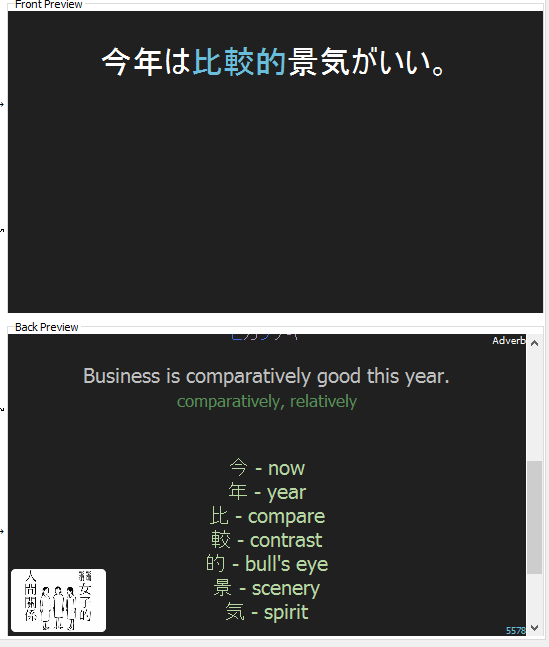
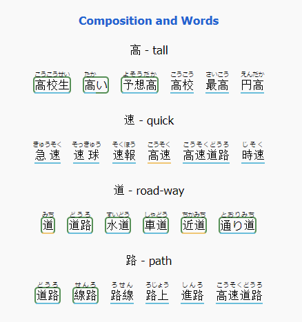
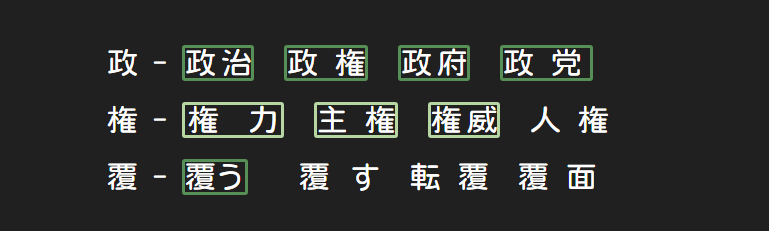
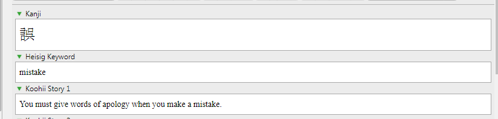
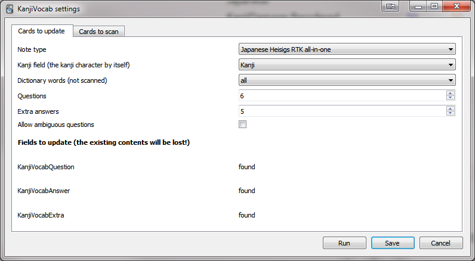
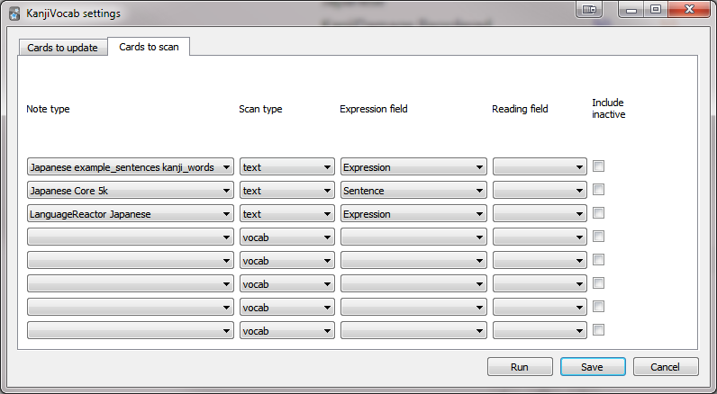
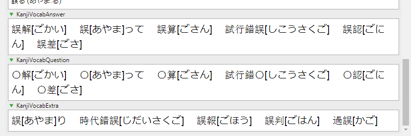

😄KanjiEater's Heisig RTK, Rebooting the Kanji - Related Vocab on Sentence Cards
========================
Introduction
------------------------
This Anki add-on can generate RTK (Remembering the Kanji) or Rebooting the Kanji Keywords to your flashcards.  
When combined with the KanjiVocab addon it can also generate related Vocab. You can have both together or only the keywords.


### RTK Only


This is how this addon will display the keywords on its own.

### Both Keywords and Vocab (on a light theme for a change)



This is how it would look like if KanjiVocab addon is also enabled.

### Vocab only


This is how it would display with KanjiVocab enabled, but if configured to hide the RTK keywords.

(Instructions for configuration can be found below)

------------------------

# Add-on Installation
Install the add-on via [AnkiWeb](https://ankiweb.net/shared/info/1855482626) or alternatively by using this code: [`1855482626`].  
To paste the code, go to Anki's main window > Tools (Menu) > Add-ons > Browse & Install.

- **Supported Anki versions:**  2.1.0~2.1.49 (further versions not tested)

This Add-on also requires the [Japanese Support](https://ankiweb.net/shared/info/3918629684) [`3918629684`] addon to get the keywords from your sentences, so not skip this step!

------------------------

Configuration
========================

The Addon needs some tweaking to work with, so we're breaking it down into small steps. Make sure not to skip any or you're likely to get errors!
-  Before starting: Back up your collection and sync to ankiweb with all devices (This is your safety in case there are any accidents!), after modifying anything make sure to not sync again before confirming everything is good.

Make sure Japanese Support is properly installed before continuing.

Getting the Deck Ready
------------------------
For this Add-on to work, it needs **TWO** decks.  
For simplicity, let's call them the Review Deck (the one you'll want to add keywords and vocab to) and the RTK Deck (this one will be the source/reference for your RTK Keywords, and also where the vocab will initially go if you're using KanjiVocab). 

The easiest approach is to download the [Japanese Heisigs RTK all-in-one](https://ankiweb.net/shared/info/1532278975) Deck from Ankiweb.

 - On your **RTK Deck** (even if you downloaded it from the web and don't plan on adding Vocab), you also need to create the field: `KanjiVocabAnswer`.  
THESE STEPS ARE VERY IMPORTANT. If you skip these you'll most likely be getting a "Failed to generate cache, does your model exist?" that will make your browser inoperable, and Anki will probably crash.

- On your **Review deck**, you need a `Keyword` and a `Reading` field. The Keyword is where the generated keywords/vocab will go, and the Reading field is where your sentence cards.

  - All those things are case-sensitive and must be copied exactly. 

### Using your Own Decks
If you'd prefer to use your own Deck, the note type either needs to be named `Japanese Heisigs RTK all-in-one`, and it must have the fields `Kanji` `Reading` `Heisig Keyword` and `KanjiVocabAnswer` (more documentation on that on the code block below)

- Alternatively, if you don't want to change the name of your fields but don't mind going into files, you can alter the `rtkModel` entry on `rtkkw.py` to reflect the fields you want to use from your existing deck.

You can find the file by going to Anki's `main window > Tools (Menu) > Add-ons` clicking on the "KanjiEaters Heisig RTK Rebooting the Kanji - Related Vocab on Sentence Cards" add-on in the list, and then clicking on "View Files". That should open the main directory where the Add-on is located.


The default settings are these:
```
srcFields = ['Reading'] #This is the expression field you want to use from your REVIEW deck. It's a field in your cards where you have sentences with Kanji that you want to generate keywords for. Despite the name, it should be an expression field without furigana. Eg. pick the field with 日がすぎた contents and not 日[ひ]がすぎた. Naturally, if there are no Kanji, there will be nothing to generate.
dstFields = ['Keywords'] #This is where the Keywords will be written on your review deck
rtkModel = 'Japanese Heisigs RTK all-in-one' #This is your RTK Kanji deck note type, the source where it'll 'reference' the VocabWords from
rtkKanjiField = 'Kanji' #This is the Kanji field in your RTK deck
rtkKeywordField = 'Heisig Keyword' # Also from your Source deck, where the RTK single kanji keyords in english are (they'll display next to the kanji)
vocabField = 'KanjiVocabAnswer'
kanjiUrl = 'http://kanji.koohii.com/study/kanji/'
vocabUrl= 'https://jisho.org/search/'
OVERRIDE = True # Regenerate over existing content. USE WITH CAUTION!
```

You can change the contents inside `''`s to better reflect your deck.

As you can see, the Kanji field needs to be a SINGLE Kanji, while the keyword is the koohi english keyword that will be displayed next to the Kanji later on.

  
How the main basic fields should look on your RTK Deck

The "Reading" field is basically any sentence you want to generate keywords for, NOT the furigana reading field. So for example:
If you currently have an Expression field with:  
  今まで何の負けもしてない  
and a Reading/Pronunciation field with  
  今[いま]までなんの負[ま]けもしてない  

You would then have to rename the Expression field to `Reading`, and the former Reading field to something else (eg Pronunciation, Sentence Pronunciation, etc).


  
An example of how a Reading and Keyword fields might look on your Review Deck after you finish this guide.


Getting the Vocab along with the Keywords
------------------------
### Dependencies
To include the Vocab, you'll need to *also* install a separate addon called [KanjiVocab (Github Repo)](https://github.com/HelenFoster/KanjiVocab) [`1600796261`]

- **Supported Anki versions:**  2.1.20~2.1.49 (further versions not tested)

### Configuring KanjiVocab
1. You need to create 3 fields on your your RTK reference deck (*remember, this is the one who holds our keywords, not the one we're reviewing*):
	- `KanjiVocabQuestion` (This is the words with masked kanji, in the front of your card)
	- `KanjiVocabAnswer` (This is the one that goes on the back of the card)
	- `KanjiVocabExtra` (Also goes on the back of the card, for words with more than one likely answer)

2. From the Anki main window, go to Tools (Menu) > KanjiVocab..  
	- On "Note type", select your RTK Deck
 	- On "Kanji field", select the Kanji field (it must be a field that only has ONE kanji - used to decide which words to add to the card)
	- On "Questions", insert the number of the vocab words you'd like to display on your cards
	
	Some other setting explanations from the developer:  
	* "Dictionary words" allows words to be taken from the dictionary by frequency (based on JMdict priority tags), even if they did not appear in any scans.
	* "Allow ambiguous questions" lets you choose whether to allow questions with more than one likely answer. Even if not, they can still appear as "extra".
	* The "Fields to update" section shows whether the listed fields have been added correctly.
	
  
	
3. In the "Cards to scan" tab, you can select multiple decks to scan for vocabulary  
	Here are some notes from the developer:  
	* "Note type" is the note type you wish to scan. A note type can appear more than once with different options.  
	* "Scan type" can be "vocab" or "text". A vocab scan considers the expression and reading as-is (the reading is optional). A text scan splits the expression with MeCab (and does not use a reading).  
	* The other drop-downs let you select the expression and reading fields for each scan.  
	* The checkboxes let you choose whether each scan will consider new and suspended cards. Words from such cards will be prioritised above dictionary words, but not counted as "known".  
	
  
I added some sentence decks I had that had sentences in it. For ease of setup I didn't bother adding the Reading fields since some decks had inconsistent ones, and just let MeCab parse it instead.
- *If* you experience errors with this option, you may need to install [MecabUnidic](https://ankiweb.net/shared/info/13462835) [`13462835`]. I can't confirm if it makes a difference since I already had it installed and KanjiVocab already includes dictionary files derived from JMdict.

4. Save your settings and hit Run, your fields should now be populated  



Getting ONLY the Vocab
------------------------
If you don't like to see the keywords above the words, you can change that on the `rtkkw.py` file in the add-on folder. Look for these bits of code:

	```
	# Message below displays both the koohi keyword (Kanji - English keyword) and the Jisho link with vocab in a second line:
	message = "<a title='{}' href='{}{}'>{} - {}</a><br><a title='{}' href='{}{}'>{}</a><br>".format(keyword, kanjiUrl, kanji, kanji, keyword, keyword, vocabUrl, search_string, note[vocabField])
	```				
If you'd like it to display only the vocab, replace that message line with the one below  
	`message = "<a title='{}' href='{}{}'>{} - {}</a><br>".format(keyword, vocabUrl, search_string, kanji, note[vocabField])`
	

Final Steps
------------------------
If you did all the above steps, hooray! Now you can simply:
1. Go to the browser
2. Select the cards you'd like to add Keywords to
3. Go to Edit (Menu) > Bulk-Add RTK Keywords
4. Don't forget to actually add the `{{Keywords}}` text to your card template so it shows up on the card text! For furgigana display you can use {{furigana:Keywords}}.


Styling the Cards According to Maturity
------------------------
Go to your Card template and add this code to the Styling Tab if you'd like it to look like the light mode screenshot on this page:
```
/* KanjiVocab*/
.kv_kanji_known, .kv_kana_known {
border: 2px solid #b6d7a2 ;
border-radius: 5px;
}

.kv_kanji_mature, .kv_kana_mature {
border: 2px solid #569056;
border-radius: 5px;
}

/* exactly one */
.kv_confuse rb {
border-bottom: 2px solid tomato;
}

.kv_likely rb {
border-bottom: 2px solid #f0c674; /* yellow*/
}
.kv_unique rb {
border-bottom: 2px solid #6abedb; /*blue*/
}
/*No underline in link*/
#slink a {text-decoration:none;}
```
But if you want to customize your styling further, these are the classes KanjiVocab uses (exctracted from KanjiVocab's readme):

* "kv_unique" for words with only one possible answer;
* "kv_likely" for words with only one likely answer;
* "kv_confuse" for words with more than one likely answer (by default these only appear as "extra" words).

Also, each word will have exactly one of the following classes (with the ones listed first being higher priority):

* "kv_kanji_mature" for words where the kanji version is mature;
* "kv_kanji_known" for words where the kanji version is known;
* "kv_kana_mature" for words where the kana version is mature;
* "kv_kana_known" for words where the kana version is known;
* "kv_kanji_inactive" for words where the kanji version was scanned from a new or suspended card;
* "kv_kana_inactive" for words where the kana version was scanned from a new or suspended card;
* "kv_unknown" for words which were not scanned.

KanjiVocab also includes a cards_example.css inside its add-on folder that you can reference from.
