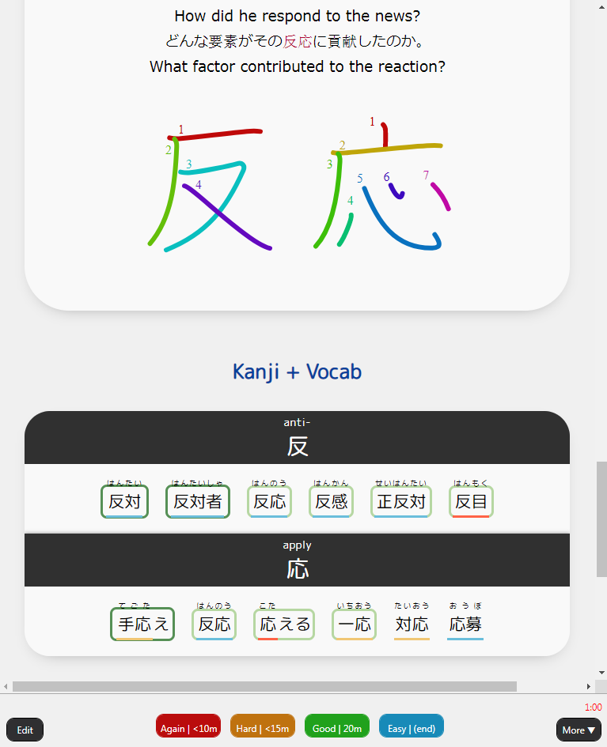
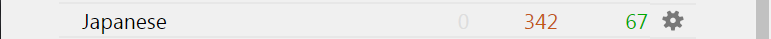
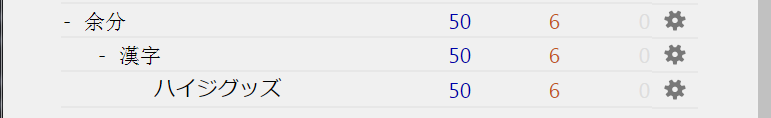
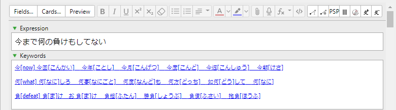
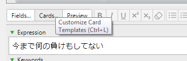
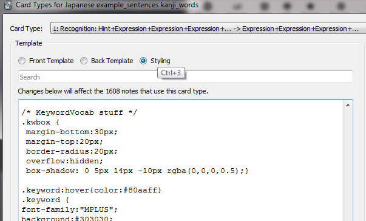
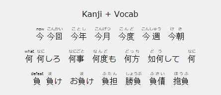
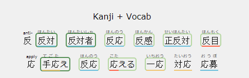
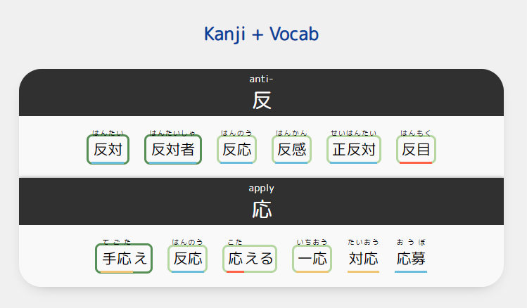

😄KanjiEater's Kanji Connections - Related Vocab on Sentence Cards - Heisig RTK
========================

## Table of Contents
- [Introduction](#Introduction)
- [Changelog](#Changelog)
- [Add-on Installation](#Add-on-Installation)
- [Configuration](#Configuration)
  - [Initial preparation](#Initial-preparation)
  - [Configuring it to work with your decks](#Configuring-it-to-work-with-your-decks)
  - [Getting the Vocab along with the Keywords](#Getting-the-Vocab-along-with-the-Keywords)
- [Final Steps](#Final-Steps)
 - [CSS Styling](#CSS-Styling)
    - [Styling the Cards According to Maturity](#Styling-the-Cards-According-to-Maturity)
    - [Styling Kanji Connections](#Styling-Kanji-Connections)
- [Troubleshooting](#Troubleshooting)
- [Support](#Support)


Introduction
========================
This Anki add-on helps you recognize at a glance what other words/relations you have that contain the same kanji on other cards.
When combined with the KanjiVocab addon it can also generate related Vocab. You can have both together or only the keywords.


### Both Keywords and Vocab (on a light theme for a change)


This is how it would look like if KanjiVocab addon is also enabled with KanjiEater's styles (RTK keyword field & furigana shows on hover).



This is how it would look like if KanjiVocab addon is also enabled with Ny's Styles (furigana is optional).

### RTK Only


This is how this addon will display the keywords on its own.

------------------------

What's new in this version
========================
**2025-02-15**
- Updated to support QT6 versions of Anki
**2022-12-15**
- User configuration is now done from inside the Anki add-on config menu (no more messing with files).
- Added ability to create a new card in the source deck when a kanji from the expression field of the review deck isn't found.
- Minor visual changes

------------------------

Add-on Installation
========================
Install the add-on via [AnkiWeb](https://ankiweb.net/shared/info/1855482626) or alternatively by using this code: [`1855482626`].
To paste the code, go to Anki's main window > Tools (Menu) > Add-ons > Browse & Install.

- **Supported Anki versions:**  2.1.0~2.1.49 (further versions not tested)

This Add-on also requires the [Japanese Support](https://ankiweb.net/shared/info/3918629684) [`3918629684`] Add-on to get the keywords from your sentences, so do not skip this step!

------------------------

Configuration
========================

The Add-on needs some tweaking to work to its full potential, so we're breaking it down into small steps. Make sure not to skip any or you're likely to get errors!
-  Before starting: Back up your collection and sync to ankiweb with all devices (This is your safety in case there are any accidents!), after modifying anything make sure to not sync again before confirming everything is good.

Again, make sure [Japanese Support](https://ankiweb.net/shared/info/3918629684) [`3918629684`] is properly installed before continuing.


Initial preparation
------------------------
For this Add-on to work, it needs **TWO** decks.
For simplicity, let's call them the Review Deck (the one with sentences, and where you'll want to add keywords and vocab to) and the RTK Deck (this one will be the source/reference for your RTK Keywords, and also where the vocab will initially go if you're using KanjiVocab).




In this image my review deck is called Japanese and my RTK source deck would be `余分::漢字::ハイジグッズ`.

----

### The easiest approach to have what you need to get started is to download the [Japanese Heisigs RTK all-in-one](https://ankiweb.net/shared/info/1532278975) deck from Ankiweb.
----

 - On your **RTK Deck** (even if you downloaded it from the web and don't plan on adding Vocab), you also need to create the field: `KanjiVocabAnswer`.
THIS STEP IS VERY IMPORTANT. If you skip these you'll most likely be getting a "Failed to generate cache, does your model exist?" that will make your browser inoperable, and Anki will probably crash.

- By default, your **Review deck** must have at least a `Keywords` and a `Expression` field (these can be customized from the config button on the anki add-on menu).

The **Keywords** is the field where this add-on will write the keywords to, and the **Expression** field is where your sentences with kanji are.


 Configuring it to work with your decks
------------------------

#### For this version, all configuration is done without leaving Anki.

From Anki's main window go to `Tools (Menu) > Add-ons`, find `KanjiEaters Kanji Connections - Related Vocab on Sentence Cards - Heisig RTK` on the list, and either double click it, or click it and then go to the **Config** button located to the right in that window.
This will open the configuration screen.

Carefully follow the instructions written on the right side of the configuration screen that popped up so it matches your decks.

An explanation of each of those settings and values can also be independently seen on the [config.md](config.md) file on github.

### Some visuals
If you're not using the recommended **RTK source** deck, this is how the Kanji and Heisig Keyword fields look on the default deck:


The **Kanji** field on your RTK deck should have a SINGLE Kanji.
And the **Heisig Keyword** is the field for the English keyword for that kanji.



An example of how an Expression and Keywords fields might look on your Review Deck after you finish this guide.


Getting the Vocab along with the Keywords
------------------------
### Dependencies
To include the Vocab, you'll need to *also* install a separate addon called [KanjiVocab](https://github.com/HelenFoster/KanjiVocab) [`1600796261`]

- **Supported Anki versions:**  2.1.20~2.1.49 (further versions not tested)

### Configuring KanjiVocab
1. You need to create 3 fields on your your RTK source deck (*remember, this is the one who holds our keywords, not the one we're reviewing*):
	- `KanjiVocabQuestion` (This is the words with masked kanji, in the front of your card)
	- `KanjiVocabAnswer` (This is the one that goes on the back of the card)
	- `KanjiVocabExtra` (Also goes on the back of the card, for words with more than one likely answer)

2. From the Anki main window, go to Tools (Menu) > KanjiVocab..
	- On "**Note type**", select your RTK Deck
 	- On "**Kanji field**", select the Kanji field (it must be a field that only has ONE kanji - used to decide which words to add to the card)
	- On "**Questions**", insert the number of the vocab words you'd like to display on your cards

	Some other setting explanations from the developer:
	* "Dictionary words" allows words to be taken from the dictionary by frequency (based on JMdict priority tags), even if they did not appear in any scans.
	* "Allow ambiguous questions" lets you choose whether to allow questions with more than one likely answer. Even if not, they can still appear as "extra".
	* The "Fields to update" section shows whether the listed fields have been added correctly.


3. In the "Cards to scan" tab, you can select multiple decks to scan for vocabulary
	Here are some notes from the developer:
	* "Note type" is the note type you wish to scan. A note type can appear more than once with different options.
	* "Scan type" can be "vocab" or "text". A vocab scan considers the expression and reading as-is (the reading is optional). A text scan splits the expression with MeCab (and does not use a reading).
	* The other drop-downs let you select the expression and reading fields for each scan.
	* The checkboxes let you choose whether each scan will consider new and suspended cards. Words from such cards will be prioritised above dictionary words, but not counted as "known".


I added some sentence decks I had that had sentences in it. For ease of setup I didn't bother adding the Reading fields since some decks had inconsistent ones, and just let MeCab parse it instead.
- *If* you experience errors with this option, you may need to install [MecabUnidic](https://ankiweb.net/shared/info/13462835) [`13462835`]. I can't confirm if it makes a difference since I already had it installed and KanjiVocab already includes dictionary files derived from JMdict.

4. Save your settings and hit Run, your fields should now be populated


---------------------

Final Steps
====================
If you did all the above steps, hooray! Now you can simply:
1. Go to the browser
2. Select the cards you'd like to add Keywords to
3. Go to Edit (Menu) > Bulk-Add Kanji Connections
4. Don't forget to actually add the `{{Keywords}}` text to your card template so it shows up on the card text! For furgigana display you can use {{furigana:Keywords}}.
5. Style the keywords according to your visual preferences (more on that below)
6. Enjoy!

---------------------

CSS Styling
====================
If you'd like to customize how this add-on is displayed on your cards, you can do so directly from your card template's "styling" section.





By default this is probably how your card will look like, but we can make it better!



Styling the Cards According to Maturity
-------------------
If we style the CSS for the KanjiVocab addon a little bit, we can see our maturity for the generated vocab:


```
/* KanjiVocab*/
 .kv_kanji_known, .kv_kana_known {
     border: 2px solid #b6d7a2 ;
     border-radius: 5px;
     padding:1.5px;
}
 .kv_kanji_mature, .kv_kana_mature {
    border: 2px solid #569056;
     border-radius: 5px;
     padding:2.5px;
}
/* exactly one */
 .kv_confuse rb {
    border-bottom: 2px solid tomato;
    padding:1.5px;
}
 .kv_likely rb {
    border-bottom: 2px solid #f0c674;
     padding:1.5px;
    /* yellow*/
}
 .kv_unique rb {
    border-bottom: 2px solid #6abedb;
     padding:1.5px;
    /* Blue */
}
/* End of KanjiVocab Formatting */
```
But if you want to customize your styling further, these are the classes KanjiVocab uses (exctracted from KanjiVocab's readme):

* "kv_unique" for words with only one possible answer;
* "kv_likely" for words with only one likely answer;
* "kv_confuse" for words with more than one likely answer (by default these only appear as "extra" words).

Also, each word will have exactly one of the following classes (with the ones listed first being higher priority):

* "kv_kanji_mature" for words where the kanji version is mature;
* "kv_kanji_known" for words where the kanji version is known;
* "kv_kana_mature" for words where the kana version is mature;
* "kv_kana_known" for words where the kana version is known;
* "kv_kanji_inactive" for words where the kanji version was scanned from a new or suspended card;
* "kv_kana_inactive" for words where the kana version was scanned from a new or suspended card;
* "kv_unknown" for words which were not scanned.

KanjiVocab also includes a cards_example.css inside its add-on folder that you can reference from.

Styling Kanji Connections
-------------------
You can change a lot without ever messing with any of the addon files, straight from your card template.



Each Keyword and its accompanying vocab are outputted to their own paragraph `<p>` using a "`kw`" class.

Keywords use the `"keyword"` class, and Vocab uses the `"keyword-vocab"` class, so each can be styled separately to match your visual preferences.

The separator uses the `"kw-separator"` class, in case you're also interested in changing the appearance for that.

There are two examples below of CSS to add to your card. Use only one set of CSS exmples (not both).

For reference this is the CSS for KanjiEater's example above:
```
/* KanjiVocab*/
p {
    margin: 0;
    padding: 0;
}

.kv_kanji_known, .kv_kana_known {
  border: 3px solid #b6d7a2 ;
  border-radius: 3px;
}

.kv_kanji_mature, .kv_kana_mature {
  border: 3px solid #569056;
  border-radius: 3px;
}

a.keyword rt {
    display: none;
}


#keyword a {
  line-height: 150%;
  font-size: .5em;
  font-size: 30px;
  text-align: left !important;
}

#keyword ruby rt {
  visibility: hidden;
  font-size: 12px;
}
#keyword ruby:hover rt { visibility: visible; }
a.keyword ruby:hover rt{
    display: block;
}
#keyword {
 margin: 0 0 0 20%;
  text-align: left !important;
}

.hidden-furigana .kana-ruby{
visibility: hidden;
}
```

For reference, this is the CSS for Ny's example above:

```
/* KeywordVocab stuff */
.kwbox {
 margin-bottom:30px;
 margin-top:20px;
 border-radius:20px;
 overflow:hidden;
 box-shadow: 0 5px 14px -10px rgba(0,0,0,0.5);}

.keyword:hover{color:#80aaff}
.keyword {
 font-family:"MPLUS";
 background:#303030;
 color:white;
 padding:18px 0 5px 0;
 display:block;
 text-align:center;
 box-shadow: 0 0 3px rgba(0,0,0,0.4);
 font-size:18px;
 margin-top:0;}

.keyword-vocab {
 font-family:"MPLUS";
 white-space:pre-line;
 display:block;
 padding:15px 10px 10px;
 line-height:2.3em;
 background-color:#f9f9f9;
 font-size:13px;}

.kanjivocab{color:#0a419b; font-family:"MPLUS"; font-weight:900;}

.kwbox > p{
 border:3px;
 padding-top:0;
 margin-block-start:0;
 margin-block-end:0;}

/* End of KeywordVocab Stuff /*

/*No underline in link*/
.slink a{text-decoration:none;}


@font-face{font-family:MPLUS;src:url('_MPLUSRounded1c-Regular.ttf') format('truetype')}

```

Here I'm using the free [MPlus (rounded) Font](https://fonts.google.com/specimen/M+PLUS+Rounded+1c?query=m+plus). More info about the font can also be found [here](https://mplusfonts.github.io/).

If you also want to include it, it must be added to your anki collection folder. Follow the official Anki documentation for instructions on [how to install custom fonts](https://docs.ankiweb.net/templates/styling.html#installing-fonts).

If not, you can remove the entire `@font-face` line of the CSS above.


To wrap it up, here's the HTML on the back of my card:
```
{{#Keywords}}
<div class="kanjivocab">Kanji + Vocab</div>
<div class="kwbox slink">{{furigana:Keywords}}</div>
{{/Keywords}}
```
------------------------

Troubleshooting
========================
srcFields = CONFIG['Expression'] error
------------------------
```
Caught exception:
Traceback (most recent call last):
  File "C:\Users---\AppData\Roaming\Anki2\addons21\1855482626__init.py", line 22, in <lambda>
    a.triggered.connect(lambda: start(browser))
  File "C:\Users---\AppData\Roaming\Anki2\addons21\1855482626__init.py", line 16, in start
    reload(rtkkw)
  File "importlib__init__.py", line 169, in reload
  File "<frozen importlib._bootstrap>", line 604, in _exec
  File "<frozen importlib._bootstrap_external>", line 783, in exec_module
  File "<frozen importlib._bootstrap>", line 219, in _call_with_frames_removed
  File "C:\Users---\AppData\Roaming\Anki2\addons21\1855482626\rtkkw.py", line 16, in <module>
    srcFields = CONFIG['Expression']
KeyError: 'Expression'
```

Something like this probably means you changed something on the rtkkw.py directly, please revert it to the original.
**All configuration changes should be done from inside Anki using the config button on the Add-on menu.**

"Failed to generate cache, does your model exist?" error
------------------------
Make sure you created the `KanjiVocabAnswer` field on your **RTK source deck**, even if you're not using the KanjiVocab add-on.

I followed ALL the instructions here and still get an error
------------------------
Please open an Issue here on github or ask for help on our [Discord Server](https://discord.com/invite/agbwB4p).


------------------------

Support
===============

If you find my tools useful please consider supporting via Patreon. I have spent countless hours to make these useful for not only myself but other's as well and am now offering them completely 100% free.

<a href="https://www.patreon.com/kanjieater" rel="nofollow"></a>

If you can't contribute monetarily please consider following on:

<a href="https://www.youtube.com/channel/UCU1cAd9sJ4HeiBDsjnmifAQ"></a>
<a href="https://twitter.com/kanjieater" title="Twitter"></a>
<a href="https://www.twitch.tv/kanjieater" title="Twitch"></a>
